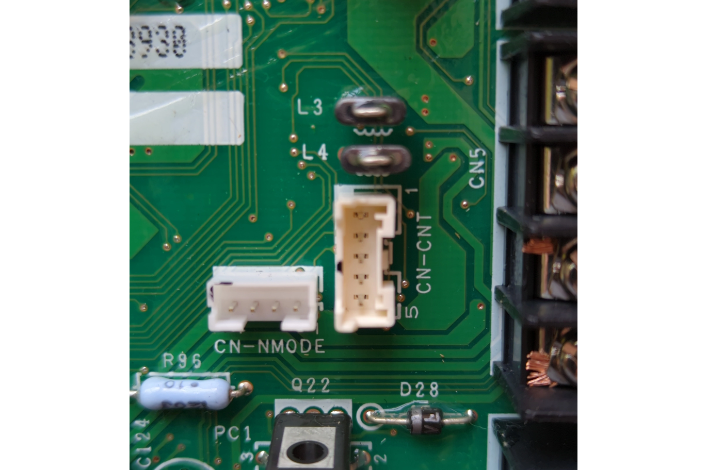

# This repo is a personal WIP
It's only meant to get the project running in a quick and dirty way.

The only differences between the upstream by @pando85 and this repo are the following notes, listed under "Known issues and mitigations". You can also find the binaries needed for the install in the releases section.

Use it at your own risk: you may damage your device or your heatpump.

That being said, I hope these notes help others.

## Known issues and mitigations
The goheishamon process fails for unknown reasons every so often (every 12-36h). Here's a modification to the goheishamon daemon definition, and a wrapper for the goheishamon binary. Please note the delay in the start (`sleep 60`), needed to allow the networking configuration to be complete.

1. Make sure you follow the configuration process for the USB drive, including the correct connection and MQTT host data.
2. Open http://your_CZ-TAW1_IP/ in your browser
3. In the top menu, go to System > Startup. Start the "goheishamon" process.
4. Wait a few seconds for the device to reach your MQTT server.
5. Launch dropbear, issuing an MQTT message with the topic `panasonic_heat_pump/commands/OSCommand` and the payload `/usr/sbin/dropbear`
6. In your terminal: `ssh -oKexAlgorithms=+diffie-hellman-group1-sha1 -oHostKeyAlgorithms=+ssh-rsa root@your_CZ-TAW1_IP`
7. Modify/create the next files:

`/etc/gh/goheishamon_wrapper.sh`:
```
#!/bin/sh

# Allow for startup to finish

sleep 60

while true; do
    /usr/bin/goheishamon 2>&1 | {
        CRASH_TOTAL=0
        LINES_PROCESSED=0

        while IFS= read -r line; do
            # Log each line via logger AND echo it (for procd)
            echo "$line"
            logger -t goheishamon "$line"

            # Check conditions
            if echo "$line" | grep -q "out of time"; then
                logger -t goheishamon "Detected 'out of time' - triggering restart"
                exit 1
            fi

            if echo "$line" | grep -q "71 6C 01 10 00 00 00 00"; then
                logger -t goheishamon "Detected crash code"
                CRASH_TOTAL=$((CRASH_TOTAL + 1))
            fi

            LINES_PROCESSED=$((LINES_PROCESSED + 1))

            # Check every 30 lines
            if [ $LINES_PROCESSED -ge 30 ]; then
                if [ $CRASH_TOTAL -ge 10 ]; then
                    logger -t goheishamon "CRITICAL: Detected $CRASH_TOTAL crash codes in last 30 lines - triggering restart"
                    exit 1
                fi
                # Reset counters
                CRASH_TOTAL=0
                LINES_PROCESSED=0
            fi
        done
        exit 0
    }

    EXIT_CODE=$?
    sleep 2
done
```

`/etc/init.d/goheishamon`:
```
#!/bin/sh /etc/rc.common
# "new(er)" style init script
# Look at /lib/functions/service.sh on a running system for explanations of what other SERVICE_
# options you can use, and when you might want them.

USE_PROCD=1
START=22

start_service() {
        logger -t goheishamon "Starting service"
        [ -e /etc/config/goheishamon.toml ] || return 1
        procd_open_instance

        procd_set_param command /etc/gh/goheishamon_wrapper.sh    
        procd_set_param respawn ${respawn_threshold:-600} ${respawn_timeout:-10} ${respawn_retry:-40}
        procd_set_param file /etc/config/goheishamon.toml
        procd_set_param pidfile /var/run/goheishamon_wrapper.pid
        procd_set_param stdout 1
        procd_set_param stderr 1

        procd_close_instance
}

stop_service() {
        logger -t goheishamon "Stopping service"
        procd_kill
        [ -e /var/run/goheishamon_wrapper.pid ] && rm -f /var/run/goheishamon_wrapper.pid
        logger -t goheishamon "Service stopped"
```

`/etc/rc.local`:
```
# Put your custom commands here that should be executed once
# the system init finished. By default this file does nothing.

logger "Start watchdog"
echo 300 > /proc/sys/kernel/panic
echo 0 > /proc/sys/kernel/panic_on_oops

(/usr/bin/check_buttons.sh > /dev/null 2>&1) &

logger -t rc.local "Execute nextboot.sh"
/etc/gh/nextboot.sh

logger -t rc.local "Clean nextboot.sh"
echo "" > /etc/gh/nextboot.sh

# New script to try to start the goheishamon daemon if it's not functional
/etc/init.d/goheishamon start

# Guarantee ssh access, even if goheishamon is not pulling MQTT commands
/usr/sbin/dropbear

#/usr/bin/a2wmain > /dev/ttyS0
#exit 0

```


# CZ-TAW1/CZ-TAW1B

This project is to modify Panasonic CZ-TAW1 Firmware to send data from heat pump to MQTT instead to
Aquarea Cloud.

## This Project Contains

- Main software (called GoHeishaMon) responsible for parsing data from Heat Pump - it's golang
  implementation of project https://github.com/Egyras/HeishaMon All MQTT topics are compatible with
  HeishaMon project: https://github.com/Egyras/HeishaMon/blob/master/MQTT-Topics.md and there are
  two aditional topics to run command's in system runing the software but it need's another manual.

GoHeishaMon can be used without the CZ-TAW1 module on every platform supported by golang
(RaspberyPi, Windows, Linux, OpenWrt routers for example) after connecting it to Heat Pump over
rs232-ttl interface. If you need help with this project you can try Slack of Heishamon project there
is some people who manage this one :)

- OpenWRT Image with preinstalled GoHeishaMon (and removed A2Wmain due to copyright issues)

CZ-TAW1 flash memory is divided for two parts called "sides". During Smart Cloud update A2Wmain
software programing other side then actually it boots ,and change the side just before reboot. In
this way, normally in CZ-TAW1 there are two versions of firmware: actual and previous. Updating
firmware with GoHeishaMon we use one side , and we can very easly change the side to Smart Cloud
(A2Wmain software) by pressing all three buttons on CZ-TAW1 when GoHeishaMon works ( middle LED will
change the color to RED and shortly after this it reboots to orginal SmartCloud). Unfortunatly from
Smart Cloud software changing the side without having acces to ssh console is possible only when
updating other side was take place succesfully.

Summary:

It is possible to go back to orginal software (A2Wmain with SmartCloud) very quick , without
preparing pendrive ,becouse this solution don't remove firmware with A2Wmain (is still on other
"side" in the flash).

Even the GoHeishaMon is on other side you can't just change the site in original software to
GoHeishaMon without access to console. You have to install GoHeishaMon again.

## WiFi configuration

WiFi should be configured in original firmware.

### Setting up WiFi Without WPS on CZ-TAW1

In the paper instructions that come with the CZ-TAW1, there's no mention of setting up WiFi without
WPS. However, in the PDF instructions found on the CD-ROM included with the device and various
online manuals, you'll find a procedure for configuring WiFi settings without using WPS.

1. **Using the HTML Utility**: The CD-ROM contains a small HTML utility that simplifies the process
   of configuring WiFi settings. This utility allows you to enter your WiFi SSID and password, which
   it then saves in a `settings.txt` file for you.

2. **USB Drive Preparation**: To proceed, insert a USB drive into your computer. We recommend using
   an 8GB FAT32-formatted USB drive (although your mileage may vary with other configurations).

3. **Create `settings.txt`**: In the utility, you'll specify your WiFi settings. The `settings.txt`
   file should have the following content (without the quotes, and there should be a newline after
   each key):

   ```plaintext
   SSID=YourSSIDHere
   KEY=APasswordBetterThanThis
   ```

4. **Transfer `settings.txt`**: Save the `settings.txt` file to the root directory of your USB
   drive.

5. **WiFi Configuration**: With the `settings.txt` file on the USB drive, insert it into the
   CZ-TAW1.

6. **Configure WiFi**: To configure the WiFi settings, press and hold the WPS button on the CZ-TAW1
   for 10 seconds. The device will read the `settings.txt` file and set up the WiFi accordingly.

7. **Final Steps**: Once the WiFi configuration is complete, you can remove the USB drive and
   install the transmitter wherever you prefer.

These steps allow you to set up your WiFi on the CZ-TAW1 without the need for WPS.

## Install instructions

New hardware should use 1.0.191 to avoid problems with PL23a3 drivers.
[Original link](https://github.com/lsochanowski/GoHeishaMon/issues/26#issuecomment-1374770882)

To install the software, follow these steps:

1. Format a USB drive to FAT32 and copy the following files to it:

   - `openwrt-ar71xx-generic-cus531-16M-kernel.bin`
   - `openwrt-ar71xx-generic-cus531-16M-rootfs-squashfs.bin`

2. Additionally, configure and copy the file named `GoHeishaMonConfig.new`.

3. Insert the USB drive with these files into your CZ-TAW1 device.

4. Press all three buttons simultaneously and hold them for more than 10 seconds. Wait until the
   middle LED on the CZ-TAW1 begins changing colors, cycling through green, blue, and red. You may
   also notice the LED on the USB drive blinking if it has one.

5. The update process will start, and it will take approximately 3 minutes. During this time, the
   CZ-TAW1 will reboot. After a while, you will see the middle LED light up in white.

6. Do not remove the drive from the module until the white LED turns off again. This indicates that
   the GoHeishaMon has copied the config file from the drive and rebooted the CZ-TAW1. Remove the
   drive before the white LED turns on again, as leaving the drive with the config file present will
   result in it being copied again and triggering another reboot.

7. After the update, you can access the CZ-TAW1 via SSH using the following password `goheishamon`. We recommend to change the password in the first login.

## Board Functionality

### Buttons

- **WPS Button**: Pressing the WPS button, middle LED will flash blue and will mount the USB and if `settings.txt` file is present, it will change the WiFi settings. Use same format as in the original firmware.
- **Reset Button**: Pressing the reset button will restart the GoHeishaMon application.
- **Check Button**: The check button does not trigger any specific action.
- **Simultaneous WPS and Reset Button Press**: When both the WPS and Reset buttons are pressed together, middle LED will flash green, and the root password will be reset to `goheishamon`.
- **Simultaneous all Button Press**: When all buttons are pressed together, the board will switch back to its original firmware.

### LEDs

- **Top LED**: This LED, illuminated in green, indicates whether the operating system (OS) is currently running.

- **Mid LED**: The white light emitted from this LED signifies that the GoHeishaMon application is in running.

- **Bottom LED**: When this LED is lit in green, it indicates the data pin's status, which is either low or high, for communication with the main board.

## Remote install

After first installation you can use the following command to install newer versions of GoHeishaMon through SSH:

```bash
TARGET_HOST=xxx.xxx.xxx.xxx make install
```

**Warning**: This command will remove the original firmware. You can restore it following the steps on this guide.

### Restore original firmware

To restore the original firmware, you need to follow these steps:

```bash
# Upload the original firmware to the CZ-TAW1
scp -O OS/original_firmware.tgz ${TARGET_HOST}:/tmp
# SSH into the CZ-TAW1
ssh root@${TARGET_HOST}
# Unpack the original firmware
cd /tmp
tar -xvzf original_firmware.tgz
# Load the original firmware to the other partition side
fwupdate fw-write /tmp/openwrt-ar71xx-generic-cus531-16M-kernel.bin /tmp/openwrt-ar71xx-generic-cus531-16M-rootfs-squashfs.bin
# Reboot the CZ-TAW1
reboot
```

## Alternative hardware

If you want to use GoHeishaMon without the CZ-TAW1 module, you can use a Raspberry Pi or any other device.

### Serial connection

There are two ways to connect to the heat pump: using the CN-CNT socket or the CN-NMODE socket. The following images show both of them:


#### CN-CNT Socket

The original serial connection cable connects to the CN-CNT socket with the following pinout (ordered from top to bottom):

| Pin | Function | Description                                   |
| --- | -------- | --------------------------------------------- |
| 1   | +5V      | Power supply (250mA max)                      |
| 2   | TX       | Data transmission FROM heat pump (0-5V level) |
| 3   | RX       | Data transmission TO heat pump (0-5V level)   |
| 4   | +12V     | Power supply (250mA max)                      |
| 5   | GND      | Ground connection                             |

#### CN-NMODE Socket

Alternatively, you can use the CN-NMODE socket with this pinout (ordered from left to right):

| Pin | Function | Description                                   |
| --- | -------- | --------------------------------------------- |
| 4   | +5V      | Power supply (250mA max)                      |
| 3   | TX       | Data transmission FROM heat pump (0-5V level) |
| 2   | RX       | Data transmission TO heat pump (0-5V level)   |
| 1   | GND      | Ground connection                             |
